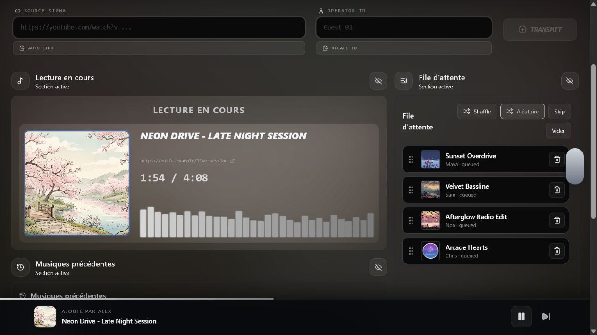
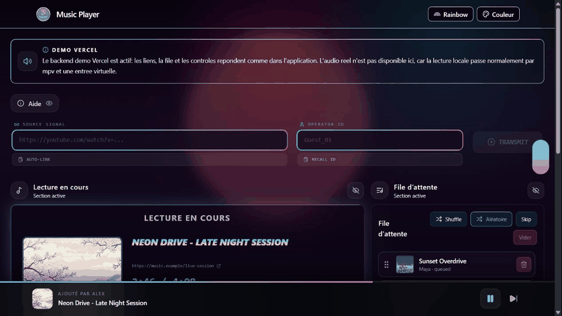
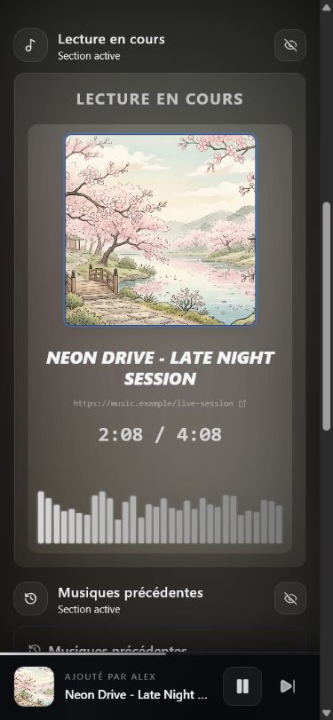

<p align="center">
  
</p>

<h1 align="center">Music Bot</h1>

<p align="center">
  Interface web moderne pour piloter un bot musical local, gérer une file d'attente partagée et router l'audio vers une entrée virtuelle.
</p>

<p align="center">
  
  
  
  
</p>

## Aperçu

<p align="center">
  
</p>

Music Bot est pensé pour une écoute locale complète: le frontend sert de panneau de contrôle, le backend résout les liens audio, pilote `mpv`, garde la file synchronisée en temps réel et bloque la lecture si le routage audio virtuel n'est pas prêt.

La démo Vercel existe seulement pour montrer l'interface depuis un lien web. Le vrai audio reste volontairement local, via `mpv` et une entrée virtuelle.

## Galerie

<p align="center">
  
</p>

<p align="center">
  
</p>

## Fonctionnalités

- Contrôle en temps réel avec Socket.IO: lecture, pause, reprise, skip, précédent, repeat, seek et vidage de file.
- File d'attente réordonnable avec historique, réajout rapide et mode aléatoire.
- Résolution de sources YouTube, SoundCloud, Spotify, Twitch, liens directs et recherche texte.
- Profils audio `balanced` et `xbox`, avec application côté `mpv`.
- Préchargement des pistes suivantes pour réduire les coupures.
- Routage audio virtuel obligatoire pour éviter une sortie involontaire sur les haut-parleurs système.
- Thèmes visuels animés: Retrowave, Aventurier, Floral Dream, Dark Room et Rainbow.
- Mode partage avec Cloudflare Tunnel pour que des amis puissent contrôler l'interface web.
- Démo Vercel isolée, sans écraser le build local servi par le backend.

## Démarrage rapide

Installe les dépendances du backend et du frontend:

```bash
npm run setup
```

Lance le bot complet avec backend local, frontend et tunnel Cloudflare:

```bash
npm run dev
```

Lance seulement en local, sans tunnel:

```bash
npm run dev:local
```

Le backend répond sur `http://localhost:4000`. Le frontend démarre sur `http://localhost:5173` ou sur le prochain port libre. Quand le tunnel est actif, partage l'URL `trycloudflare.com` affichée dans le terminal.

## Prérequis audio

Le mode local complet a besoin de:

- Node.js et npm.
- `mpv` disponible dans le `PATH`, ou configuré avec `MPV_BIN`.
- Une route audio virtuelle prête avant la lecture.
- Windows: VoiceMeeter, avec le périphérique `WINDOWS_MPV_AUDIO_DEVICE` configuré au besoin.
- Linux: PulseAudio/PipeWire avec un sink virtuel, activable via les variables `LINUX_*`.
- Optionnel: `cloudflared` pour le partage web.

Le backend vérifie le routage au démarrage. Si l'entrée virtuelle n'est pas prête, l'interface affiche une alerte et la lecture est bloquée pour éviter une sortie audio système.

## Commandes utiles

```bash
npm run build:backend
npm run build:frontend
npm run build:frontend:vercel
```

Le build local du frontend écrit dans `frontend/dist`, qui est servi par le backend local. Le build Vercel écrit dans `frontend/dist-vercel` pour garder la démo séparée du vrai mode local.

## Démo Vercel

La démo Vercel est volontairement limitée:

- `api/demo.js` simule une file d'attente en mémoire.
- `frontend/src/hooks/useVercelDemoQueue.ts` remplace le client Socket.IO seulement en mode Vercel.
- `frontend/src/components/DemoAudioNotice.tsx` indique clairement que l'audio réel n'est pas disponible dans la démo.
- `vercel.json` publie uniquement `frontend/dist-vercel`.

```bash
npm --prefix frontend run build:vercel
```

Cette séparation est importante: le mode local doit continuer à servir `frontend/dist` et à utiliser le backend Socket.IO réel.

## Architecture

```text
.
|-- api/demo.js                         # Backend léger pour la démo Vercel
|-- backend/src/server.ts               # API HTTP, Socket.IO et routes de contrôle
|-- backend/src/player.ts               # Boucle de lecture, file, historique, préchargement
|-- backend/src/mpv.ts                  # Pilotage mpv et profils audio
|-- backend/src/platforms/              # Détection YouTube, SoundCloud, Spotify, Twitch, direct
|-- frontend/src/App.tsx                # Composition de l'interface
|-- frontend/src/hooks/useLiveQueue.ts  # Client local Socket.IO ou client de démo Vercel
|-- frontend/src/components/            # Lecteur, file, historique, thèmes, alertes
`-- scripts/dev.mjs                     # Lanceur local backend + frontend + Cloudflare
```

## Variables d'environnement

| Variable | Rôle |
| --- | --- |
| `MPV_BIN` | Chemin personnalisé vers `mpv`. |
| `AUDIO_PROFILE` | Profil audio par défaut: `balanced` ou `xbox`. |
| `WINDOWS_MPV_AUDIO_DEVICE` | Périphérique audio Windows utilisé par `mpv`. |
| `VOICEMEETER_PATH` | Chemin vers VoiceMeeter sur Windows. |
| `YTDLP_COOKIES_PATH` | Fichier cookies pour aider la résolution YouTube. |
| `SPOTIFY_CLIENT_ID` | Identifiant Spotify, si les liens Spotify sont utilisés. |
| `SPOTIFY_CLIENT_SECRET` | Secret Spotify. |
| `SPOTIFY_REFRESH_TOKEN` | Refresh token Spotify. |

## Notes de développement

- Le backend local sert `frontend/dist`.
- La démo Vercel sert `frontend/dist-vercel`.
- Ne mélange pas ces deux sorties de build: c'est ce qui protège le vrai chemin audio local.
- Les captures du README utilisent des données de démonstration pour montrer l'interface sans lancer de lecture réelle.
